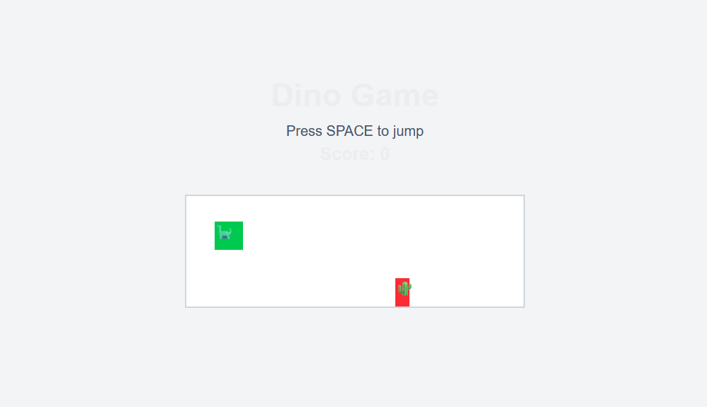

[1] - prompts usados:

- Help me transform this next project into one with 3 paths: one with a simple game (like the chrome one), one with my email and linkedin and another with a simple json response as a health check

- Now, create 2 files for gitactions pipelines, one to push the code and another to do a health chec

- Also, make so the health check also check the app versions with the last commit

Screenshot:

[2] - 

Desenho base da arquitetura: https://whimsical.com/arquitetura-V9mQvQip4bjdvFFmT151oY
